# robochart2sim-epsilon
Epsilon programs for model-to-model transformation from RoboChart to RoboSim.

## Installation instructions

### Importing projects from the Git repository into Eclipse

1. Copy the address `git@github.com:robo-star/robochart2sim-epsilon.git` into the clipboard.

2. Within Eclipse choose `File > Import` and then choose `Git > Projects from Git (with smart import)`.

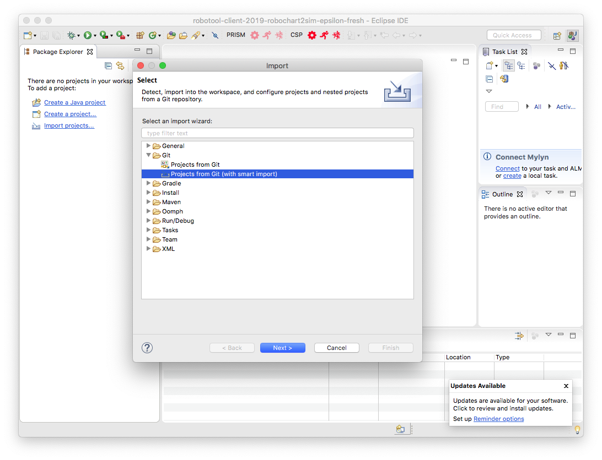

3. Click `Next` and choose `Clone URI`. The configuration for the repository will be filled in 
automatically, based on the information copied into the clipboard.

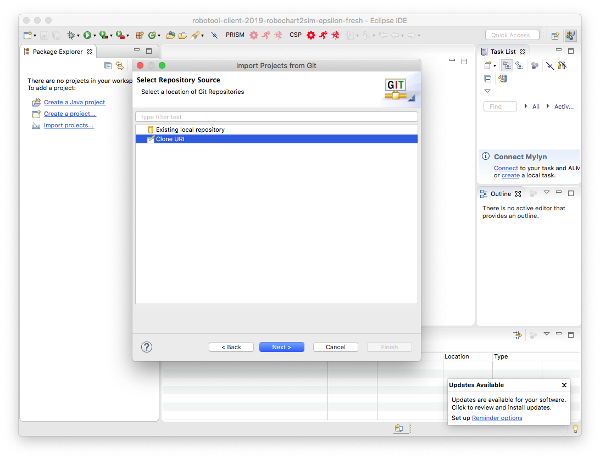

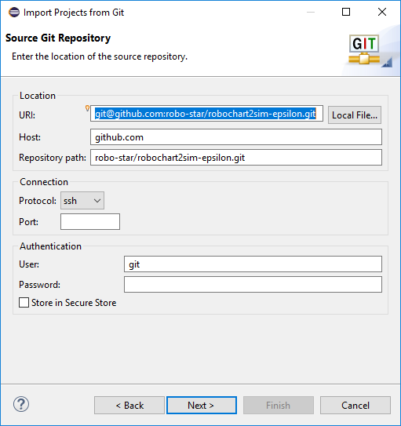

4. Click `Next` and Eclipse will attempt to authenticate to GitHub. The following prompts may be displayed.

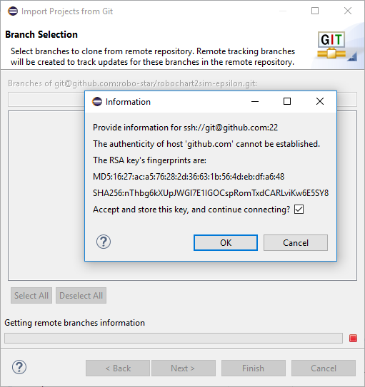

In particular, you will be prompted for the `pass phrase` used for the SSH key.


5. Choose the `master` branch.

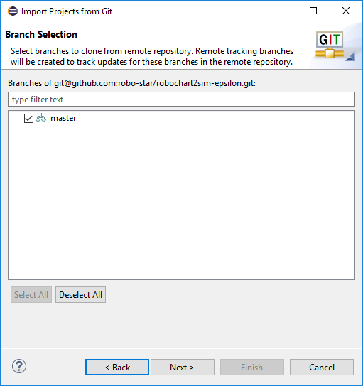

6. Click `Next` and you will be prompted for a folder where to save the git repository locally.

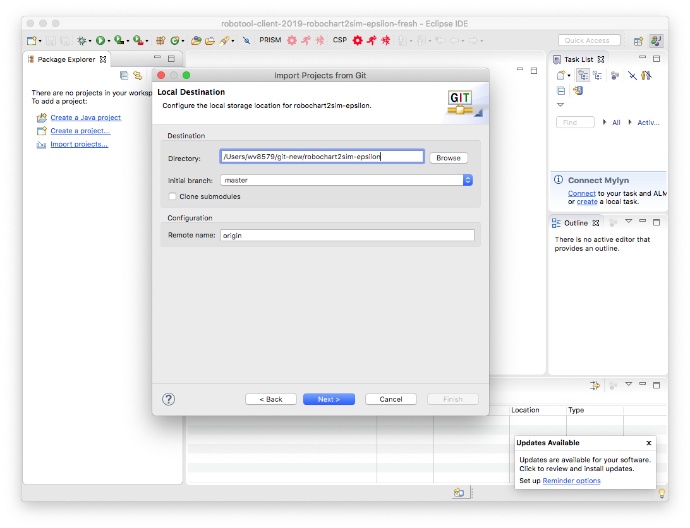

7. Choose all Eclipse projects to be imported.

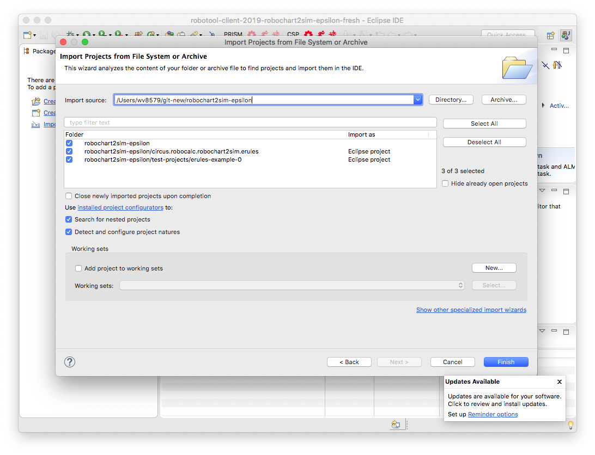

8. Finally click `Finish`.

### Repository and projects' structure.

This repository is structured as follows. 

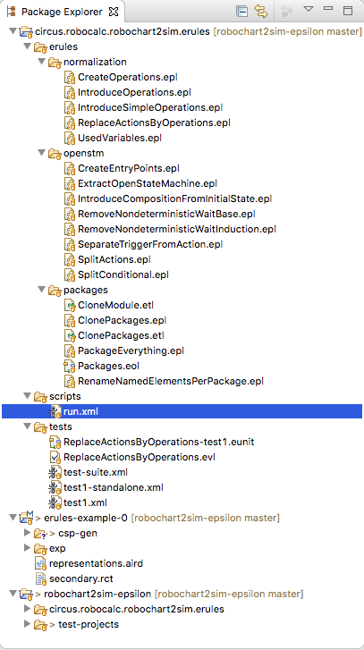

The project `circus.robocalc.robochart2sim.erules` contains the Epsilon transformation rules, organized by purpose into folders `normalization`, `openstm` and `packages`.

```
circus.robocalc.robochart2sim.erules [Epsilon transforms]
|
+--- erules (containing Epsilon programs)
|  |
|  +-- normalization (rules for normalization in RoboChart)
|  +-- openstm (rules for extracting and manipulating OpenStateMachines)
|  +-- packages (rules for cloning RoboChart modules and packages)
|
+-- scripts (containing ANT scripts)
|
+-- tests (sketch of EUnit testing using Epsilon)
```

The project `erules-example-0` is a particular instance of a simple example used to exercise the transformation. The idea here is that other RoboChart projects will be added to this repository so as to build a test suite.

## Transformations

As discussed above, the Epsilon rules are stored in the folder `erules` of the project `circus.robocalc.robochart2sim.erules`. Currently, Epsilon programs are invoked using ANT scripts defined in the folder `scripts`.

### Running for the first time

1. To run an ANT script for the first time, select the desired .xml file (for example `run.xml` in the `scripts` folder) and right-click it. Then select `Run As > 2 Ant Build ...`. It is important that the second option is selected as there is some further configuration necessary.

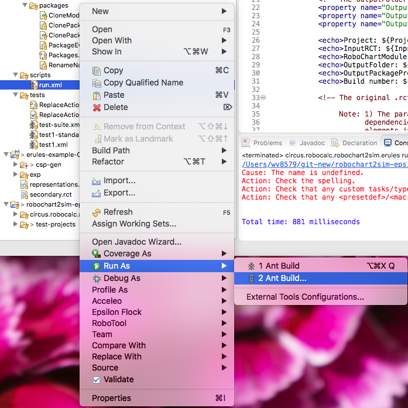

2. Afterwards the following configuration window will appear. It is essential that under the `JRE` tab the option `Run in the same JRE as the workspace` is selected. This is because the ANT script is designed to run within Eclipse.

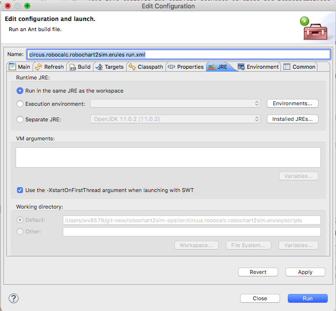

*Note*: it is possible to configure Epsilon so that it runs independently of Eclipse. To do so requires further changes to the RoboTool distribution in order to provide the infrastructure that can parse `.rct` files, so this is not possible at the moment.

3. Click `Apply` and `Run`. If successful, a folder `out` will be created under the project `erules-example-0`. For each run of `run.xml` a uniquely numbered subfolder of `out` is created that contains at most one copy for each `.rct` file of the original project, with cloned RoboChart objects. An example is shown below.

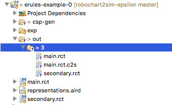

Here we have copies of `main.rct` and `secondary.rct`, as well as a `main.rct.c2s` which contains `OpenStateMachine`s extracted from the RoboChart model. By default `run.xml` has been parametrised to load `main.rct` of project `erules-example-0` and to transform the RoboChart module named `M`. Because `main.rct` depends on components defined in `secondary.rct` this file is automatically loaded by Epsilon, and so the output contains both `main.rct` and `secondary.rct`.

For the purpose of this example, we also have a file `tertiary.rct` in the folder `erules-example-0/exp`. However, because module `M` does not depend on it, the file `tertiary.rct` is neither loaded nor are any contents cloned.

#### Cloning strategy
The cloning of a RoboChart module (`RCModule`) is implemented by the Epsilon ETL program in `erules/packages/CloneModule.etl`. The main idea here is to clone each RoboChart `RCPackage` that is in scope, which is not a built-in library package, and which contains elements transitively required by the specified module. That is, either the module is in that package and contains some other elements, like controllers or state-machines, or the module contains references to controllers, state-machines and operation definitions (possibly in a different file, so in a different `RCPackage`) that need to be cloned as part of the transformation to RoboSim.

Currently, the rules in `CloneModule.etl` do not yet fully calculate the complete transitive dependency closure, but they sufficiently over-aproximate it by cloning controllers, state-machines and operation definitions defined in `RCPackage`s loaded as a result of a module's transitive dependency closure. Importantly, it excludes cloning `Interface`s and robotic platforms, as the idea here is to clone a `RCModule` and reuse all definitions that stay intact in the transformation, like interfaces and data types. Note that this does not preclude the transformation from introducing new elements.

### Configuring the ANT script `run.xml`

Currently, the script `run.xml` defines three properties that are considered as an input to the transformation.
```
<property name="Project" value="platform:/resource/erules-example-0/" />
<property name="InputRCT" value="main.rct"/>
<property name="RoboChartModule" value="M" />
```
The `Project` property defines the URI of the project for transformation. The scheme `platform:/resource/x` is used in Eclipse to identify the project of name `x` within the current workspace. The reason for using an URI, rather than files, is that this seems to give more consistent results to when using Epsilon within Eclipse, namely the capability to automatically load other `.rct` files with transitive dependencies, and also to abstract from the physical file system locations.

The `InputRCT` property defines the main `.rct` file which contains the RoboChart path of the module file to be transformed, specified relative to the `Project` property. In this case, the transformation actually loads the file at location `platform/resource/erules-example-0/main.rct`.

The `RoboChartModule` defines the name of the module as defined in the `main.rct`. Note that currently we are not providing the capbility to provide a Fully Qualified Name to identify a particular module. It is envisioned in the future that this is a parameter that could be prompted from the user, either using an Eclipse integration or directly using Epsilon's languages that provide facilities to query for user input in transformations.

## Updating files

The following paragraphs describe how changes can be committed back to this repository using the built-in Git implementation in Eclipse.

### Tracking a file

If a file is not `tracked` by Git, it cannot be version controlled. Therefore, similarly to SVN, files need to be added to the repository. In Eclipse this is acomplished by choosing the file, right-clicking and selecting `Team > Add to Index`.

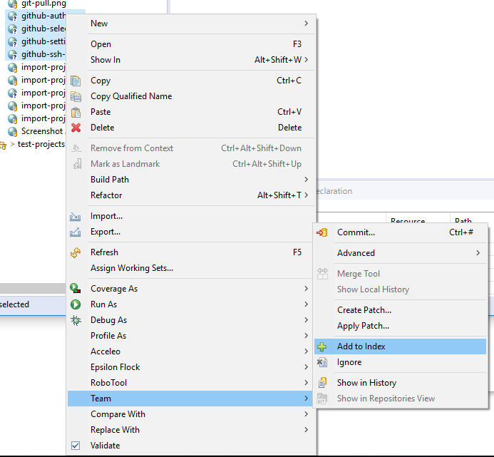

### Making a commit

A commit can be initiated by right-clicking on a file, or a project, and selecting `Team > Commit`. Typically Git requires a commit message to be written.

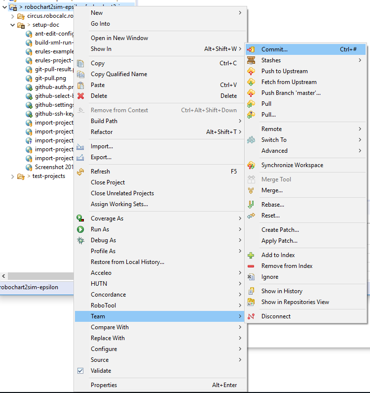

### Pushing the commit

Commits are pushed to the on-line repository (known in Git as an origin) by doing a `Push`. This can be accomplished in the previous screen by pressing `Commit and Push`, which commits and pushes the changes in one step. When pushing the user may be prompted to authenticate using the SSH key, for which a passphrase may need to be entered. If successful, a screen similar to that below will be shown.

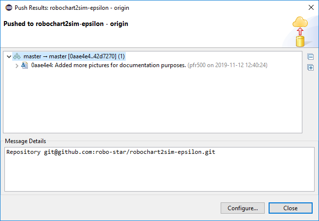

### Updating the local copy

Similarly to SVN updates, in Eclipse the local copy is updated by right-clicking on the desired project and selecting `Team > Pull`.

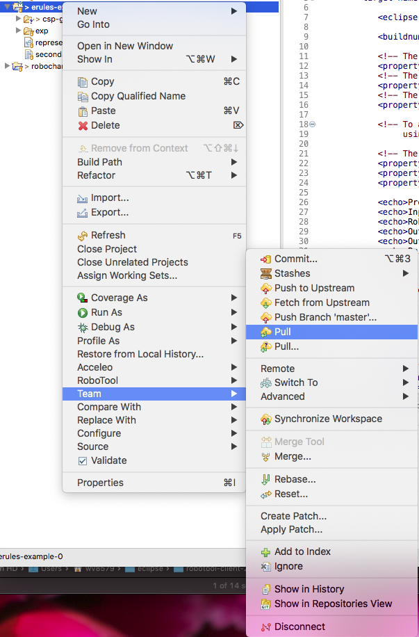

If successful, a dialog will be shown with the result of pulling the changes.

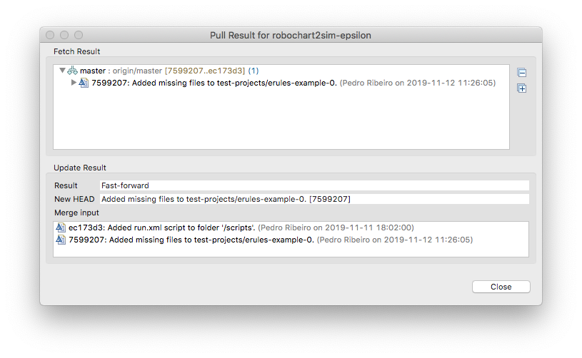

# Viewing the registered EMF models

To view the registered EMF models directly from within Eclipse, Epsilon provides a nice PackageRegistry view. It can be enabled by doing the following.

1. Selecting `Window > Show View > Other`.

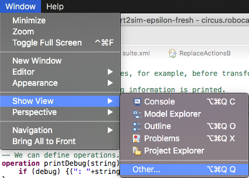

2. Selecting `Epsilon > EPackage Registry`, followed by `Open`.

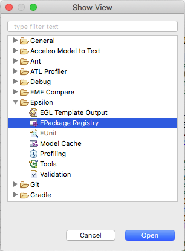

3. By default the view is unpopulated, so it needs to be refreshed to show all currently registered models. Click on the double arrow icon `Refresh`.

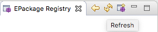

4. Now it is possible to view all meta-models of interest, namely `C2S` and `RoboChart`. The models, and their elements, are ordered alphabetically (unlike the standard ECore reflective model viewer), as shown below.

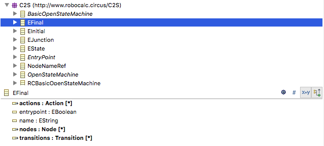

Based on some quick observations, the ECore classes seem to be formatted as follows:

* Italics: Abstract class.

And the EAttributes are formatted as follows:

* Bold: Inherited attribute.
